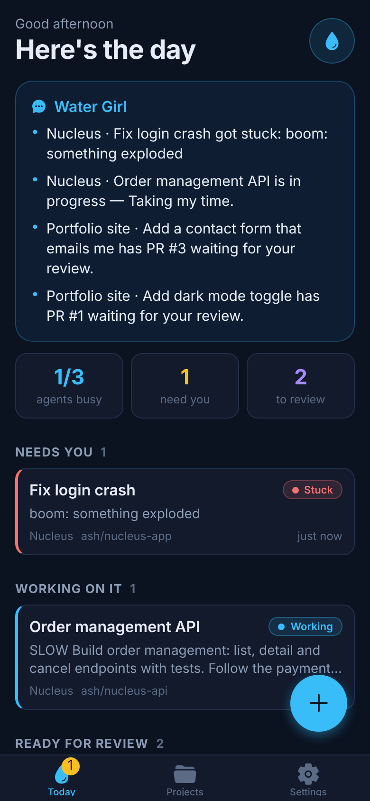
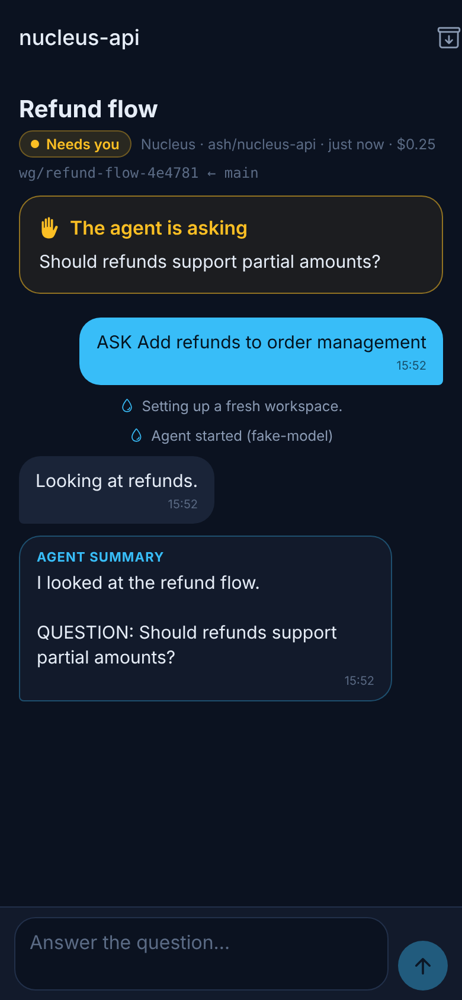
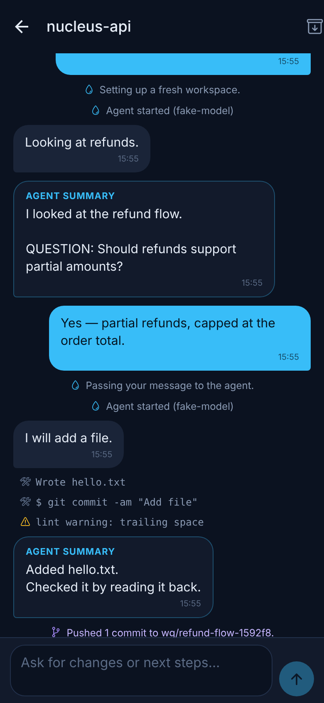
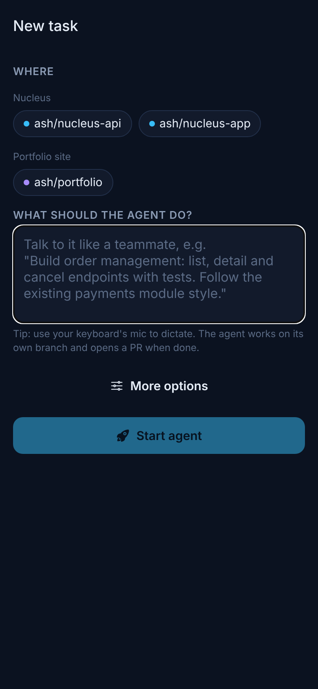

# 💧 Water Girl

Your personal "Friday" for code. Tell her what to build and in which repo. She
starts a coding agent (Claude Code), keeps it on its own branch, tells you when
it needs a decision, opens the PR, and lets you merge from your phone.

<p>
  
  
  
  
</p>

```
 Phone app (Expo)  ──HTTPS──▶  Water Girl server  ──▶  Claude Code (one per task, own git worktree)
                                   │                          │
                                   └──── GitHub API ◀─────────┘  push branch · open PR · merge
```

- **Many repos, many GitHub accounts.** Each account has its own token, so there's no logging out and back in.
- **Parallel agents.** Each task gets its own `git worktree` and branch (`wg/<title>-<id>`), so several agents can work on the same repo at once.
- **Feedback.** You get a live timeline of what the agent is doing, a ping when it's stuck or done, and a "standup" summary across all projects.
- **Talk to it like a teammate.** Reply to an agent's question or ask for changes. It carries on in the **same Claude session**.
- **Merge from the phone.** You see PR status and checks, then merge with one tap. The workspace is cleaned up afterwards.

See [PLAN.md](PLAN.md) for the full roadmap.

## Repo layout

| Path | What |
|---|---|
| `apps/server` | Brain + worker: Fastify API, SQLite, runs agents, talks to git/GitHub |
| `apps/mobile` | The phone app (Expo / React Native, Expo Router) |
| `packages/shared` | API types shared by both |

## 1. Run the server (always-on machine: VPS or home PC)

Requirements: **Node 22.18+**, **git**, and the **Claude Code CLI**.

```bash
npm install -g @anthropic-ai/claude-code
claude setup-token          # log in with your Claude subscription, prints a long-lived token
export CLAUDE_CODE_OAUTH_TOKEN=...   # (or ANTHROPIC_API_KEY=... to pay per use)

git clone <this repo> && cd watergirl
npm install
npm run server
```

On first start it prints an **App token**. You'll paste that into the phone app.

> Run it as a normal (non-root) user. Agents run unattended with
> `bypassPermissions`, and Claude Code refuses that as root. Ideally use a
> dedicated machine or VPS just for this.

### Settings (environment variables)

| Variable | Default | Meaning |
|---|---|---|
| `PORT` / `HOST` | `8787` / `0.0.0.0` | Where the API listens |
| `WG_DATA_DIR` | `./data` | Database, clones, worktrees, secrets |
| `WG_TOKEN` | generated → `data/api-token` | Token the app must send |
| `WG_SECRET_KEY` | generated → `data/secret.key` | 64 hex chars; encrypts GitHub tokens |
| `WG_MAX_PARALLEL` | `3` | Agents running at once (the rest queue). Your Claude plan's limits apply. |
| `WG_MODEL` | CLI default | Default model alias/name for new tasks |
| `WG_PERMISSION_MODE` | `bypassPermissions` | Claude Code permission mode for agents |
| `WG_CLAUDE_BIN` | `claude` | Path to the Claude Code CLI |
| `WG_NTFY_URL` | – | e.g. `https://ntfy.sh/my-secret-topic`, for push without building the app |

### Reach it from your phone

The easiest and safest option is [Tailscale](https://tailscale.com) on the server and your
phone; then use `http://<machine-name>:8787` in the app. Or put it behind
HTTPS with a reverse proxy (e.g. Caddy) if you want a public URL.

## 2. Install the phone app

**Android, quickest:** open the repo's **Releases** page on your phone, download the
latest `watergirl-*.apk` and open it. Allow "install unknown apps" for your browser
when asked. Every push to `main` that touches the app publishes a new build, and you can
start one by hand: *Actions → Android APK → Run workflow*. PR builds attach the APK to the
run's *Artifacts* instead.

**iPhone:** sideloading requires an Apple developer account. Until then, use Expo Go:

```bash
npm run mobile        # starts Expo; scan the QR code with the Expo Go app
```

Everything works in **Expo Go** except push notifications. For push, you have two options:

- Use **ntfy**: set `WG_NTFY_URL` on the server and install the free ntfy app. No build needed.
- Make your own build: `cd apps/mobile && npx eas-cli@latest init && npx eas-cli@latest build --profile development`,
  then tap **Settings → Turn on notifications** in the app.

## 3. First use

1. **Connect:** enter the server address and the App token.
2. **Settings → Connect a GitHub account:** paste a fine-grained token
   (Contents RW, Pull requests RW, Metadata R, Checks R). Repeat for each account.
3. **Projects → New project** (e.g. *Nucleus*) **→ Add a repo** (from any connected account).
4. Tap **+**, pick the repo and describe the work in plain words. Dictation works.

## How a task runs

1. Water Girl clones the repo once (`data/repos/owner/name`), then creates a
   worktree for the task (`data/worktrees/<task>`) on a fresh branch.
2. Claude Code runs headless in it:
   `claude -p … --output-format stream-json --session-id <uuid>`. Each step
   (files edited, commands run) becomes a line in the app's timeline.
3. The agent commits its work but never pushes. Water Girl commits any
   leftovers, pushes the branch with that account's token and opens a PR. The
   token is sent per command, so it's never written into the repo's git config.
4. If the agent is blocked it ends with `QUESTION: …`. The task turns
   **Needs you** and you get a ping. Your reply runs
   `claude --resume <uuid>` in the same worktree.
5. **Merge** squash-merges on GitHub, deletes the branch and removes the worktree.

## Development

```bash
npm test             # server end-to-end tests (fake Claude CLI + fake GitHub + local git remote)
npm run typecheck    # server + app
npm -w @watergirl/mobile run web   # run the app in a browser
```

## Security notes (single-user tool)

- One bearer token protects the API. Use HTTPS or Tailscale.
- GitHub tokens are encrypted at rest (AES-256-GCM) and never sent back to the app.
- Agents don't receive Water Girl's own `WG_*` settings. But they do have a
  shell as the same OS user, so treat the server machine as the agents' machine.
  Running each agent in its own sandbox user or container is on the roadmap.
